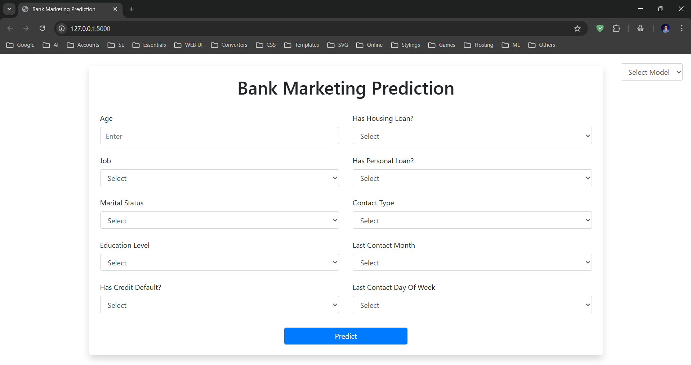
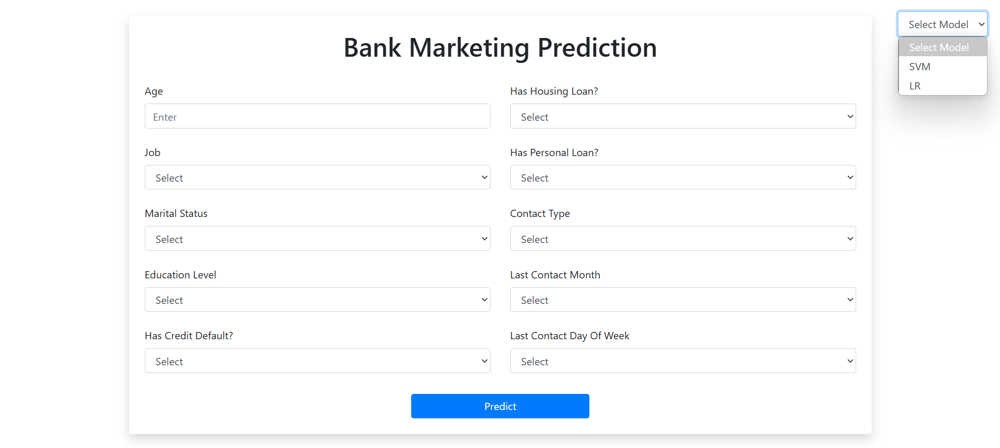

# 💰 Bank Marketing Prediction 💰

This project focuses deploying the svm and lr models in AWS ECS using a CI/CD pipeline to predict whether a client will
subscribe to a term deposit as part of the course work for GDSE66 at IJSE.

## 🛠️ Tech Stack

✅ Python  
✅ Flask  
✅ Pandas  
✅ joblib  
✅ AWS  
✅ ECR  
✅ ECS  

## 🚀 Key Features

✅ Evaluate model performance with classification metrics.  
✅ Deploy models using AWS ECS with CI/CD pipeline.  
✅ Preprocess user input with label encoding and feature scaling.  
✅ Provide predictions using SVM and Logistic Regression models.  

## 📸 Screenshots

### Model

### Result

## 📝 Version

**1.0.0**

## 📬 Get in Touch

If you encounter any issues, have questions, or need assistance with the code, feel free to reach out!

📧 [kavithmathushal9007@gmail.com](mailto:kavithmathushal9007@gmail.com)

#### This project is licensed under the [GNU License](LICENSE)

#### © 2025 All Rights Reserved | Designed by [Kavithma Thushal](https://github.com/Kavithma-Thushal)

